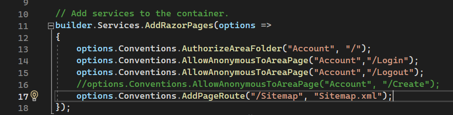
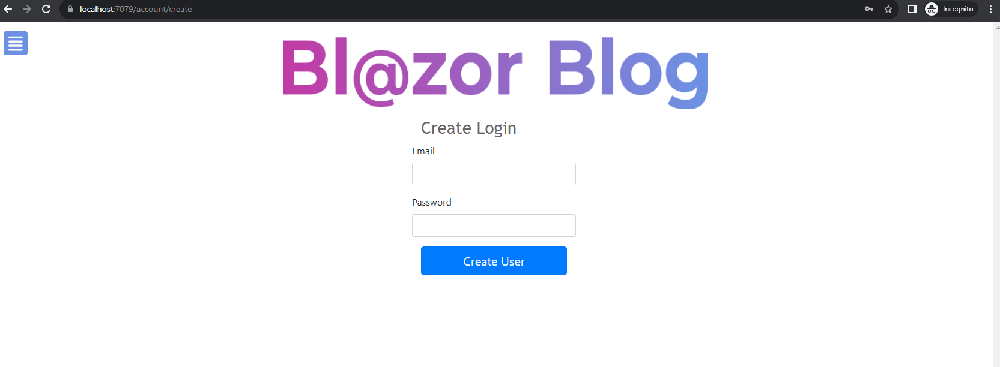

<h1 align="center">


<br/>
BlazorBlog
</h1>

### **BlazorBlog** is a new, open source, simple blog platform, built with Blazor. 

BlazorBlog is a new, open source, simple blog platform, built with Blazor.

BlazorBlog is designed to be simple, flexible and extensible.

Built against [.NET Blazor7](https://learn.microsoft.com/en-us/aspnet/core/blazor/?view=aspnetcore-7.0).


## License
  
- BlazorBlog is licensed under the [MIT License](https://github.com/sedgey/BlazorBlog/blob/master/LICENSE.txt)

## Getting started

1. Clone the repository and make sure to open the solution file in Visual Studio
```
git clone https://github.com/sedgey/BlazorBlog.git
```
2. Add an appsettings.json file to the BlazorBlog project with the following content, be sure to replace all entries surrounded with #### 
you should also create an empty sql server/sql express database and note the connection string:
```JSON with comments
{
  "DetailedErrors": true, // turns on CircuitOptions.DetailedErrors
  "Logging": {
    "LogLevel": {
      "Default": "Information",
      "Microsoft": "Warning",
      "Microsoft.Hosting.Lifetime": "Information",
      "Microsoft.AspNetCore.SignalR": "Debug" // turns on SignalR debugging
    }
  },
  "AllowedHosts": "*",
  "ConnectionStrings": {
    "default": "####Your Database Connection String####" // e.g. Data Source=YourComputer\\SQLEXPRESS;Integrated Security=True;Database=BlazorBlog;Trust Server Certificate=true;
  },
  "CustomSettings": {
    "ProdBlogUrl": "####The Production Url Of Your Blog####",  // e.g. https://blog.yoursite.com (no trailing / required)
    "DevBlogUrl": "####The Devlopment Url For Your Blog####", // e.g. https://localhost:58945
    "SiteName": "####Blazor Blog#####", //  e.g. will appear anywhere the blog name is used on the site, for example on the privacy page or in the meta tags in the header and page titles etc
    "TagLine": "####Talking about life, the universe and everything####" // will appear in the meta tags in the header
  }
}
```
3. Open the package manager console and cd into the blog project folder:
```
cd BlazorBlog
```
 Then run the following command to generate an entity framework migration: 
 ```
 dotnet ef migrations add InitialCreate
 ```
 And finally update your database.
 ```
 dotnet ef database update
 ```
 4. Additionally you can brand the blog by replacing the following files located in the wwwroot/images folder:
    - logo.png (960px X 150px)
    - logosmall.png (630px X 100px)
 5. Uncomment the following line in program.cs (line 16)
 ```C#
 options.Conventions.AllowAnonymousToAreaPage("Account", "/Create");
 ```
 
 6. Run the project

 # Set Up
 Now the project is running you need to create a user login:
 1. Navigate to /account/create and create a user login (the route you allowed by uncommenting the line in the program.cs file)\
 __<span style="color: red">It is ESSENTIAL that you comment out or delete (recommended) this line in your program.cs as soon as possible to prevent the creation of any new user logins.</span>__\
 **note: you can have multiple logins and multiple authors, but since it is a single blog, any user is able to edit/create/archive/draft any post and authors are not linked to logins.** 
 
 2. Edit the existing Post/Category/Author or create and post your own categories/authors/blog posts. 